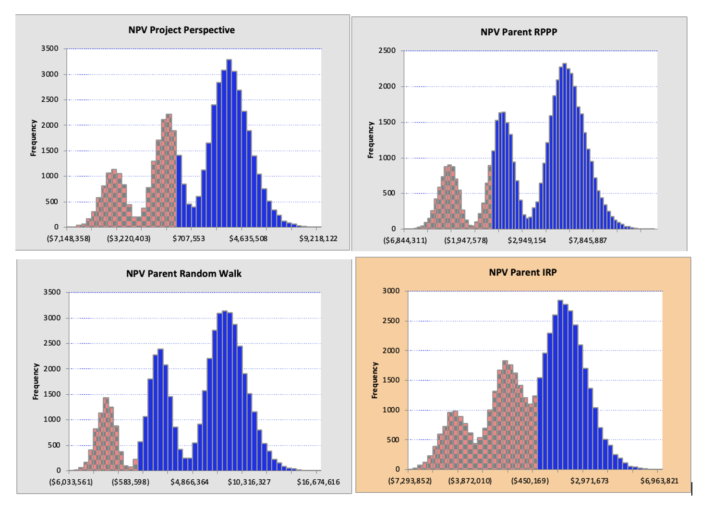
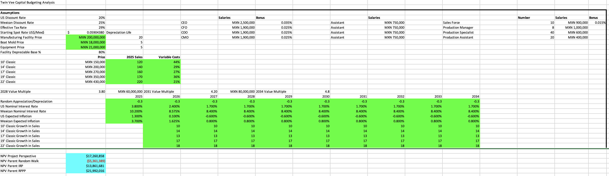
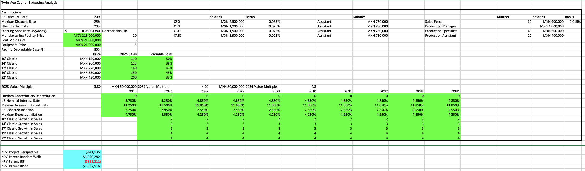
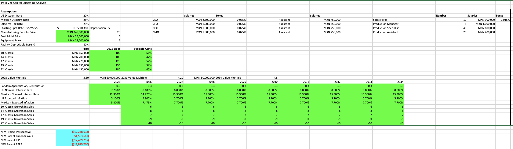

# 🌎 Multinational Capital Budgeting Model
### Monte Carlo Simulation | FX Risk Modeling | NPV Analysis | Real Options

---

## 📌 Project Overview

This project was developed as part of **FIN 630 – International Finance** at the **University of Tampa (Fall 2024)**. It evaluates a U.S. company's (Twin Vee PowerCats) potential expansion into Mexico using a fully dynamic, multi-scenario capital budgeting model.

The model analyzes Net Present Value (NPV) from both the **project (MXN) perspective** and the **parent (USD) perspective**, integrating operational uncertainty, exchange rate risk, inflation, interest rates, and managerial decision rules through Monte Carlo simulation via **Oracle Crystal Ball®**.

> **Note:** This was an academic project built on real company data and course-provided assumptions. The financial model, scenario logic, sensitivity analysis, and written analysis are my own original work.

---

## 🎯 Objective

To determine whether the firm should **accept or reject** the foreign investment by:
- Forecasting **10 years of cash flows** (2025–2034) across 5 product lines
- Modeling **exchange rate uncertainty** using three FX forecasting methods
- Simulating **thousands of risk scenarios** via Monte Carlo
- Comparing NPV outcomes under different frameworks and termination rules

---

## 🛠 Model Components

### 1️⃣ Pro-Forma Financial Model
- Revenue forecasts across 5 product lines with inflation-adjusted pricing
- Variable cost distributions, operating expenses, and salary inflation
- Depreciation schedules (facility, molds, equipment)
- After-tax operating cash flows and terminal value logic

### 2️⃣ Exchange Rate Modeling
Three FX forecasting approaches were implemented and compared:

| Method | Description |
|--------|-------------|
| **Random Walk** | No predictable trend; volatility-driven simulation |
| **Interest Rate Parity (IRP)** | Forward rates derived from interest rate differentials |
| **Relative PPP** | FX rates driven by inflation differentials between US and Mexico |

### 3️⃣ Monte Carlo Simulation (Oracle Crystal Ball®)

Key assumption cells modeled with probability distributions:
- Facility purchase price — *Triangular distribution*
- Variable cost percentages — *Normal distributions*
- Sales forecasts — *Uniform distributions*
- Inflation & interest rates — *Normal distributions with correlation structure*

**Correlation structure:**
| Variable Pair | Correlation |
|---------------|-------------|
| U.S. inflation ↔ U.S. interest rates | 0.95 |
| Mexico inflation ↔ Mexico interest rates | 0.85 |
| U.S. inflation ↔ Mexico inflation | 0.25 |

### 4️⃣ Real Options & Termination Rules
- Evaluation checkpoints at **2027** and **2030**
- Conditional early sale based on cash flow thresholds
- Terminal value multiple if held to **2034**

---

## 📊 Key Findings
- The **22' Classic model** was the dominant NPV driver across all scenarios
- **Variable costs** had the strongest negative sensitivity impact
- FX risk increased volatility but improved median NPV under **RPPP**
- Termination rules materially **reduced downside risk**
- Project NPV was **positive under base case** across all three FX methods

---

## 📸 Model Screenshots

### Monte Carlo NPV Distributions — 10,000 Simulated Scenarios
*Probability distributions of NPV across all four perspectives (Project, RPPP, Random Walk, IRP)*

---

### Scenario Analysis — Three-Case Comparison

**Best Case** — Higher sales volumes, favorable FX conditions

**Base Case** — Expected market conditions

**Worst Case** — Lower sales volumes, declining growth, adverse FX

> Each scenario dynamically updates all 10 years of cash flows, FX forecasts, and NPV outputs
> across all three exchange rate methodologies (IRP, PPP, Random Walk).

## 📁 Repository Contents

| File | Description |
|------|-------------|
| `Twin Vee fall.xlsx` | Completed financial model with Monte Carlo outputs |

---

## 🧠 Skills Demonstrated
`Multinational Capital Budgeting` `NPV & IRR Analysis` `FX Risk Modeling` `Monte Carlo Simulation` `Oracle Crystal Ball®` `Scenario Analysis` `Real Options` `Dynamic Excel Modeling`

---

*Developed as part of FIN 630 – International Finance | University of Tampa | Fall 2024*
